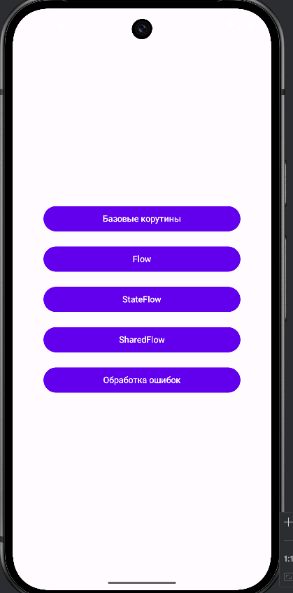

# Лабораторная работа №10: Корутины и Flow в Android

**Студент:** Иванилов Владислав
**Группа:** Пр-313п
**Предмет:** Мобильное программирование

## 📱 О проекте

Приложение демонстрирует работу с корутинами и Flow в Android с использованием Jetpack Compose.

## 🎥 Видео демонстрация

## 📸 Скриншоты

### Главный экран

### Часть 1: Базовые корутины

- Кнопка "Запустить долгую операцию" с задержкой 2 секунды
- Кнопка "Вычислить сумму" для расчета суммы чисел
- Индикатор загрузки во время выполнения

### Часть 2: Flow

- Отображение чисел от 1 до 10 с задержкой
- Преобразованный Flow с квадратами четных чисел
- Обработка ошибок в Flow

### Часть 3: StateFlow

- Счетчик с кнопками +1, -1, Сброс, +5
- Автоинкремент с запуском/остановкой
- Индикатор активности автоинкремента

### Часть 4: SharedFlow

- Генерация случайных событий
- Автоматическая генерация каждые 2 секунды
- Отображение последних 10 событий

### Часть 5: Обработка ошибок

- Успешная операция
- Операция с ошибкой
- Flow с обработкой ошибок
- Безопасная операция с Result

## 🛠 Технологии

- **Язык:** Kotlin
- **UI:** Jetpack Compose
- **Асинхронность:** Coroutines, Flow, StateFlow, SharedFlow
- **Навигация:** Navigation Compose

## 📋 Функционал

### Часть 1: Базовые корутины
- `simulateLongOperation()` - имитация долгой операции
- `calculateSum()` - вычисление суммы в фоновом потоке
- Управление состоянием загрузки

### Часть 2: Flow
- `numberFlow()` - генерация чисел от 1 до 10
- `transformedFlow()` - преобразование и фильтрация
- `errorFlow()` - демонстрация обработки ошибок

### Часть 3: StateFlow
- Счетчик с сохранением состояния
- Автоинкремент с управлением корутиной
- collectAsState() для подписки

### Часть 4: SharedFlow
- Генерация событий с replay=3
- Автоматическая и ручная генерация
- Отмена корутин при выходе

### Часть 5: Обработка ошибок
- try-catch в корутинах
- Оператор catch в Flow
- Result для безопасной обработки
